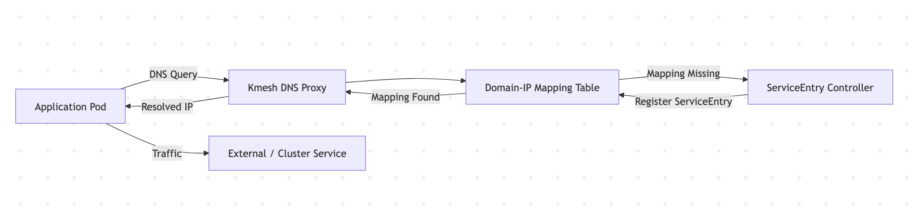
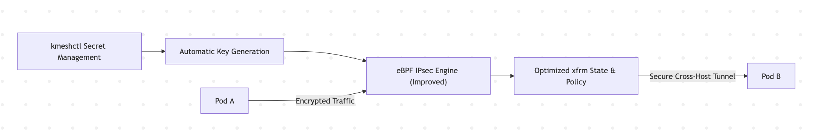
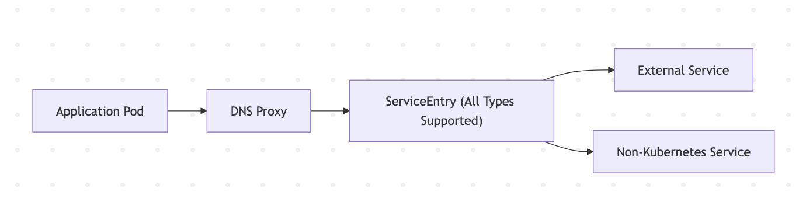
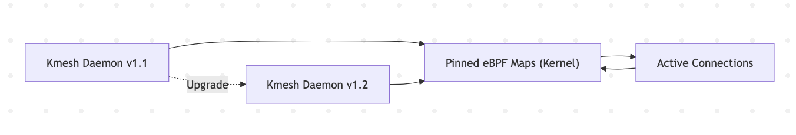
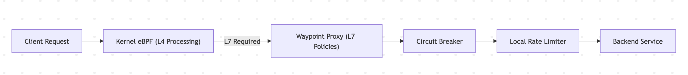
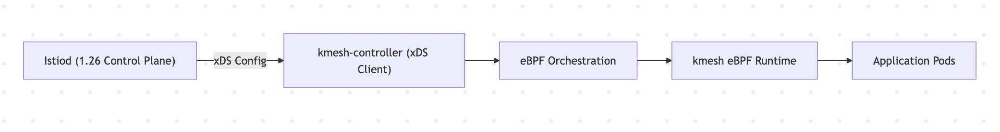

We are delighted to announce the release of Kmesh v1.2.0, a milestone achieved through the collective efforts of our global community over the past three months. Special recognition goes to the contributors from the LFX Project, whose dedication has been pivotal in driving this release forward.

Kmesh v1.2.0 represents a significant step forward in service mesh capabilities, with improved DNS handling, better ServiceEntry support, enhanced upgrade processes, and expanded feature set in dual-engine mode. These improvements make Kmesh more robust and compatible with the latest service mesh standards.

## What Makes v1.2.0 Special?

Kmesh v1.2.0 strengthens its position as a high-performance, eBPF-native service mesh by introducing:

- Intelligent DNS interception
- Stabilized and simplified IPsec encryption
- Complete ServiceEntry support
- Alpha zero-downtime daemon upgrades
- Enhanced dual-engine resilience features
- Full Istio 1.26 adaptation

Let’s explore these innovations in detail.

### 1. DNS Proxy — Smarter Service Discovery

Service discovery is foundational in distributed systems. In `v1.2.0`, Kmesh introduces DNS Proxy capability, allowing it to intercept and manage DNS resolution requests directly.

#### Key Improvements

**DNS Request Interception**

- Kmesh now captures DNS resolution requests for mesh-managed services.
- Enables tighter control over traffic routing and service visibility.

**Domain-to-IP Mapping Table**

- Dedicated internal mapping table for domain-to-address resolution.
- Improves consistency and observability of name resolution.

**Managing Non-Kubernetes Native Services**
• Leveraging dnsProxy, ServiceEntry can now manage external or non-native services via fake hostnames.
• Expands integration flexibility across hybrid environments.

**Result**: Better visibility, control, and integration for modern multi-environment deployments.

### 2. IPsec Enhancements — Stability Meets Simplicity

Security is non-negotiable in service mesh environments. v1.2.0 delivers major improvements to Kmesh’s eBPF-based IPsec implementation.

#### Stability Improvements

A critical interoperability issue between Kmesh-managed and unmanaged nodes across hosts has been resolved.

What changed?

- Redesigned eBPF decryption logic
- Optimized xfrm state and policy configuration
- Eliminated cross-host communication failures

#### Simplified Secret Management

kmeshctl now supports secret resource management for encryption keys:

- Automatic key generation
- Easier secret lifecycle management
- Streamlined IPsec configuration

**Result**: Stronger encryption with smoother operations.

### 3. Enhanced ServiceEntry Support — Full External Integration

Kmesh now provides complete ServiceEntry type support, enabling seamless external service integration.

#### What’s New?

- Full support for all ServiceEntry types
- External services integration without limitations
- DNS-based control for non-native services inside clusters

This unlocks broader hybrid-cloud and legacy integration scenarios.

### 3. Zero-Downtime Upgrade (Alpha) — Continuous Availability

Building upon earlier restart-safe architecture, Kmesh v1.2.0 introduces daemon upgrade without disrupting existing connections, as long as BPF map structures remain unchanged.

Why It Matters

- Upgrades without traffic interruption
- Reduced maintenance risk
- Higher production reliability

Currently in Alpha phase, but marks a major step toward seamless lifecycle management.

### 4. Dual-Engine Mode — Resilience Under Pressure

Dual-engine mode receives powerful traffic management enhancements:

#### Circuit Breaking

Prevents cascading failures by stopping requests to unhealthy services.

#### Local Rate Limiting

Protects services from traffic spikes and overload conditions.

Together, these features provide:

- Improved system stability
- Better microservices fault tolerance
- Granular traffic control

### 5. Istio Compatibility — Now with 1.26 Support

Kmesh v1.2.0 fully adapts to Istio 1.26, allowing users to benefit from the latest security and ecosystem advancements.

#### Deprecation Notice

- Istio 1.23 is no longer supported in E2E testing.
- Users are encouraged to upgrade for improved security and performance.

## Acknowledgment

The release of Kmesh v1.2.0 is the result of an incredible global collaboration over the past three months. This milestone reflects the dedication, expertise, and open-source spirit of our growing community.

We would like to express our sincere gratitude to all contributors:

|              |                  |               |                 |
| ------------ | ---------------- | ------------- | --------------- |
| @hzxuzhonghu | @LiZhenCheng9527 | @YaoZengzeng  | @Flying-Tom     |
| @zrggw       | @yashisrani      | @AkarshSahlot | @mdimado        |
| @Vinnu124    | @wxnzb           | @072020127    | @xiaojiangao123 |

Your efforts in improving test coverage, refining eBPF logic, strengthening IPsec interoperability, enhancing kmeshctl, and maintaining documentation workflows were instrumental in shaping this release.

We are deeply grateful to everyone who contributed code, documentation, testing, ideas, and feedback. Together, we are building a powerful, sidecarless, eBPF-native service mesh for the cloud-native ecosystem.

💙 Thank you for being part of the Kmesh journey.

## Reference Links

- [Kmesh Release v1.1.0](https://github.com/kmesh-net/kmesh/releases/tag/v1.2.0)
- [Kmesh GitHub](https://github.com/kmesh-net/kmesh)
- [Kmesh Website](https://kmesh.net/)
