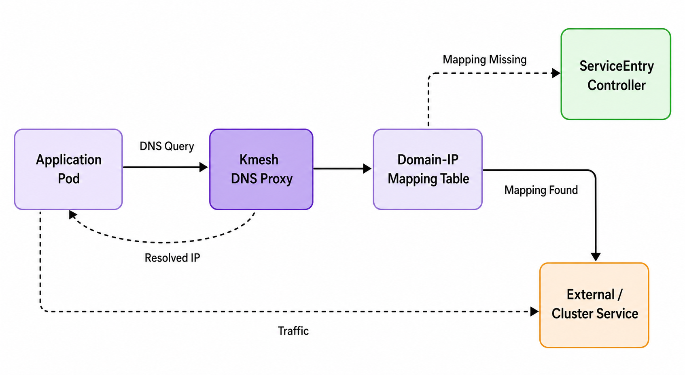
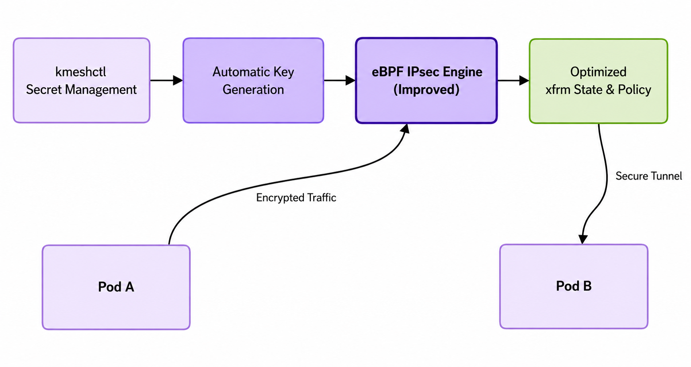
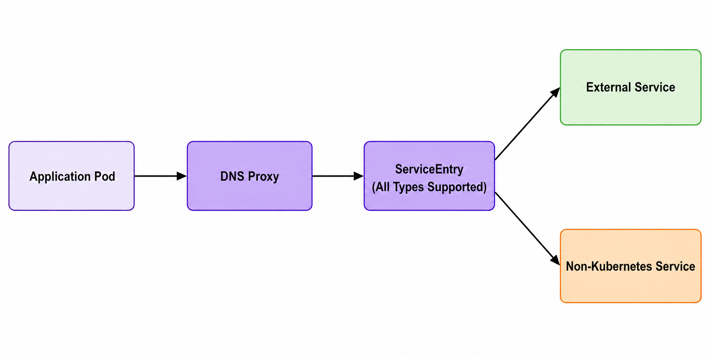
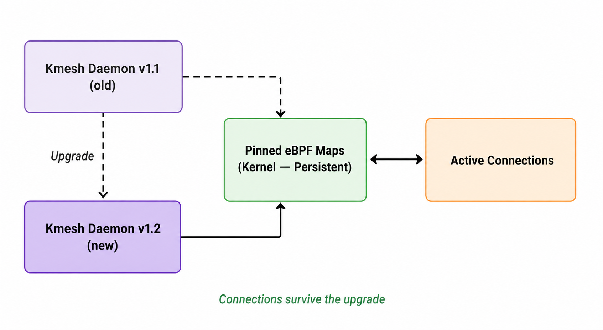
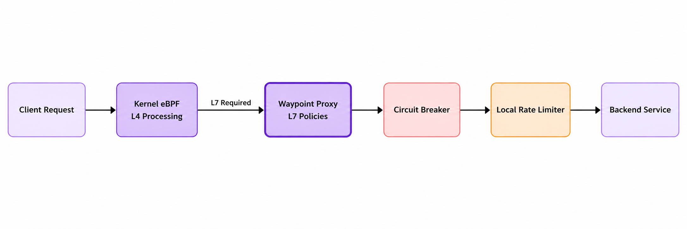
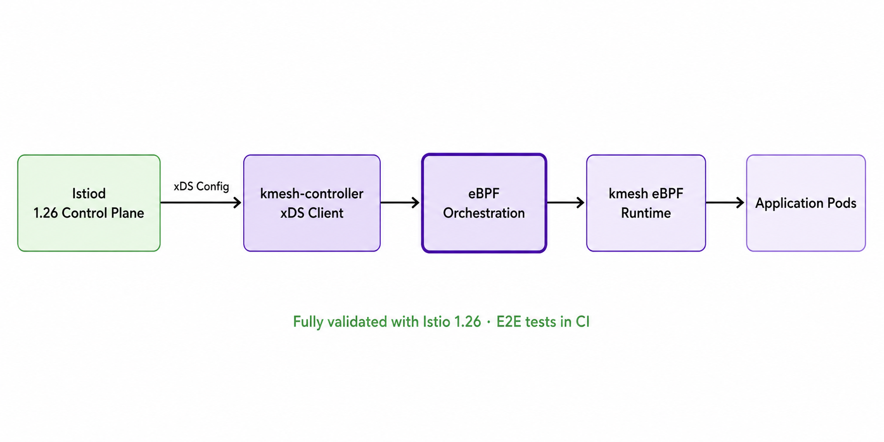

We are excited to announce the release of Kmesh v1.2.0, the result of three months of focused work from contributors across the globe. This release has been a long time coming and it shows. DNS proxy, complete ServiceEntry support, zero-downtime upgrades, IPsec stability fixes, dual-engine resilience features, v1.2.0 does not ship one big thing. It ships a dozen things that were quietly broken or missing, and fixes them all at once. Special thanks to the contributors from the LFX Project whose work was central to getting this release out the door.

## Main Features

### DNS Proxy

This is the feature that makes half of everything else in this release possible.

Before v1.2.0, Kmesh had no real handle on DNS. It worked alongside the cluster's DNS resolution flow but couldn't intercept or influence it. That ceiling showed up everywhere in ServiceEntry limitations, in dual-engine mode constraints, and in the gap between what Kmesh could theoretically govern and what it could actually reach.

v1.2.0 adds a proper DNS proxy. Kmesh now intercepts DNS resolution requests for services it manages and maintains its own internal domain-to-address mapping table. This means Kmesh knows what's being resolved, when, and can act on it. If you've ever hit a wall with Kmesh and external service management, this is the feature that tears it down.

### Enhanced IPsec

Two things happened here. One was a bug fix that needed to happen. The other was a quality of life improvement that should have happened sooner.

The bug: there was a silent interoperability failure in the eBPF IPsec implementation where cross-node communication between Kmesh-managed and unmanaged hosts could break without obvious symptoms. The kind of issue that is brutal to debug because it does not always reproduce and when it does, the failure mode points you in the wrong direction. The fix required redesigning the eBPF decryption logic from the ground up and reworking how xfrm state and policy were being configured. It is done now.

The improvement: `kmeshctl` can now manage IPsec secrets directly. Creating and rotating encryption keys used to take more steps than it should have. That is fixed.

### Complete ServiceEntry Support

ServiceEntry support in Kmesh has been a "mostly works" situation for a while. v1.2.0 finishes it.

All ServiceEntry types are now fully implemented. But the bigger story is what DNS proxy unlocks here. ServiceEntry can now manage non-Kubernetes native services using fake hostnames. Legacy workloads, third-party APIs, services that live outside the cluster, they can now be brought under Kmesh governance. This changes the scope of what "inside the mesh" means in a Kmesh environment.

### Zero-Downtime Upgrade Capability

This one has a caveat: it is currently alpha. But the problem it solves is real and worth calling out.

Upgrading the Kmesh daemon used to mean accepting connection disruption. In v0.5.0, we made restarts non-disruptive. v1.2.0 extends that guarantee to the full upgrade workflow: as long as BPF map structures have not changed between versions, upgrading the daemon will not drop existing connections. For a data plane component that sits directly in the path of all service-to-service traffic, this matters enormously.

Test it. Send feedback. Help get it to stable.

### Dual-Engine Mode: Circuit Breaking and Local Rate Limiting

Dual-engine mode has been closing the gap with sidecar-based meshes with every release. v1.2.0 adds two features that belong in any production-grade service mesh: circuit breaking and local rate limiting.

Circuit breaking stops traffic from flowing to failing endpoints before the failure cascades. Local rate limiting gives per-instance control over traffic surges. Neither of these is a flashy feature. They are the kind of thing you only notice when they are missing, usually at the worst possible time. Dual-engine mode now has them.

### Istio 1.26 Compatibility

Full compatibility with Istio 1.26 has been validated and added to CI. As part of this update, Istio 1.23 has been removed from the E2E testing matrix. If you are still on Istio 1.23, this is your signal to plan that upgrade.

## Acknowledgment

Kmesh v1.2.0 includes contributions from 16 contributors across the global community. We would like to express our sincere gratitude to all contributors:

|              |                  |            |               |
| ------------ | ---------------- | ---------- | ------------- |
| @Flying-Tom  | @zrggw           | @yashisrani| @AkarshSahlot |
| @mdimado     | @Vinnu124        | @wxnzb     | @072020127    |
| @xiaojiangao123 | @Kuromesi     | @YaoZengzeng | @LiZhenCheng9527 |
| @lec-bit     | @hzxuzhonghu     | @yp969803  | @sancppp      |

We have always developed Kmesh with an open and neutral attitude, and continue to build a benchmark solution for the Sidecarless service mesh industry, serving thousands of industries and promoting the healthy and orderly development of service mesh. Kmesh is currently in a stage of rapid development, and we sincerely invite people with lofty ideals to join us!

## Reference Links

* [Kmesh Release v1.2.0](https://github.com/kmesh-net/kmesh/releases/tag/v1.2.0)
* [Kmesh GitHub](https://github.com/kmesh-net/kmesh)
* [Kmesh Website](https://kmesh.net/)