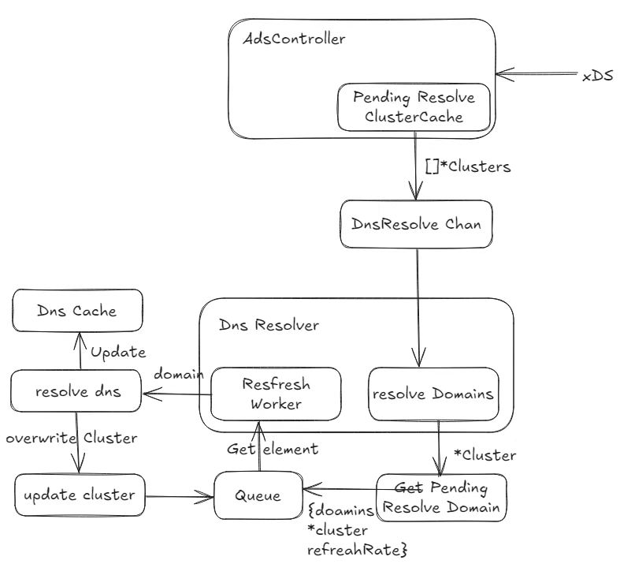
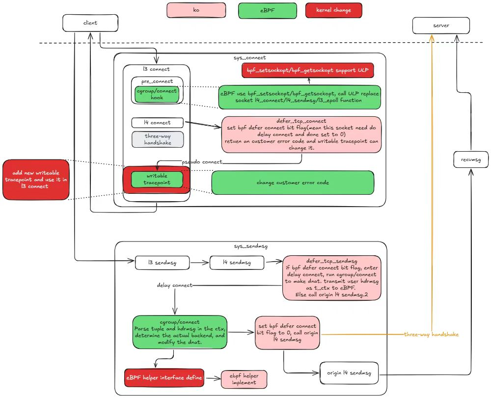

We are excited to announce the release of Kmesh v1.2.0, continuing the project’s steady evolution toward a production-ready, kernel-native service mesh.

Building on the solid foundation established in v1.1, this release focuses on strengthening reliability, improving upgrade safety, and deepening compatibility with the Istio ecosystem. Over the past release cycle, the community has worked closely to identify real-world operational challenges and address them through targeted enhancements and refinements.

Kmesh v1.2.0 is the result of sustained collaboration across the open-source community, with valuable contributions from developers and users worldwide, including continued support from the LXF Project. Rather than introducing disruptive changes, this release emphasizes making existing capabilities more robust, predictable, and ready for long-running production workloads.
Alongside these enhancements, the Kmesh website and documentation continue to evolve, maintaining clarity and accessibility for both new and existing users.

## Core Enhancements in v1.2

### DNS & dnsProxy

Building on the DNS refactor introduced in v1.1, v1.2 adds dnsProxy capabilities, allowing Kmesh to intercept DNS resolution requests for managed services.

 A dedicated domain-to-IP mapping table improves hostname resolution reliability and simplifies integration with non-Kubernetes-native services. These enhancements ensure consistent service discovery across all operating modes and improve overall DNS performance in complex deployment scenarios.
 

### IPsec Enhancements

Kmesh v1.2 strengthens security and operational stability with enhanced IPsec support. Critical interoperability issues between Kmesh-managed and unmanaged nodes were resolved through redesigned eBPF decryption logic and optimized configuration of xfrm state and policies.

 Additionally, the kmeshctl tool now provides secret management for encryption keys, simplifying creation and lifecycle management of secrets for secure communication.

### ServiceEntry Improvements

ServiceEntry support has been fully expanded in v1.2. Users can now seamlessly integrate a wide range of external services, including non-Kubernetes-native workloads, leveraging dnsProxy. This improvement broadens the scope of service mesh integration and simplifies connectivity across hybrid environments.

### Zero-Downtime Upgrade

Building on v0.5.0 achievements, v1.2 introduces the ability to upgrade the Kmesh daemon without disrupting established connections when BPF map structures remain unchanged. Currently in the alpha phase, this feature significantly reduces service downtime during maintenance operations and enhances overall reliability in production deployments.

### Dual-Engine Mode Enhancements

Dual-engine mode now supports circuit breaking and local rate limiting, providing more granular control over service-to-service communication. These capabilities improve resilience, protect against service failures and traffic surges, and enhance system stability under varying load conditions.

### Istio Compatibility Updates

Kmesh v1.2 ensures full compatibility with Istio 1.26, allowing users to leverage the latest features and security improvements. Support for Istio 1.23 has been deprecated in CI testing, encouraging upgrades to newer versions for improved performance and feature availability.

## Critical Bug Fixes & Stability Improvements

Kmesh v1.2 includes numerous fixes and refinements that enhance stability, reliability, and operational safety. Our team and contributors have focused on resolving critical issues, improving security, and ensuring production-readiness across multiple layers of the service mesh.

### IPsec & Security Enhancements

Communication issues between pods with IPsec enabled were resolved, and kmeshctl now supports automatic key generation for secrets, simplifying secure communication setup. Additional E2E tests were added to verify correctness and prevent regressions. These changes improve both usability and cluster security.
See GitHub PRs #1496, #1487

### Kmeshctl & Workflow Fixes

Several enhancements were made to kmeshctl and development workflows, including new commands, preparation scripts (prepare-dev), and documentation sync workflows. Minor usability issues were corrected, streamlining developer interaction with the CLI and reducing friction during setup and maintenance.
See PRs #1426, #1498

### eBPF & Kernel-Native Fixes

Flaky test cases related to cross-namespace communication and connection metrics were fixed, and the cgroup_skb eBPF program was added to improve network packet handling. These fixes strengthen reliability in kernel-native mode and reduce errors in production environments.
See PRs #1452, #1474

### CI, Dependency & Documentation Updates

Dependencies were upgraded to resolve vulnerabilities, CI workflows were refined, and documentation improvements including markdown linting and Chinese grammar checking were applied. These changes ensure secure, reliable builds and improve usability for contributors.
See PRs #1434, #1484

### Istio Adaptation & Upgrade Safety

Kmesh v1.2 fully adapts to Istio 1.26, deprecating older versions in CI testing. Proposals and features enabling zero-downtime upgrades ensure that Kmesh can be updated without disrupting existing connections, enhancing production readiness.
See PRs #1513, #1503, #1441

Together, these fixes and enhancements make Kmesh v1.2 significantly more robust, stable, and secure, providing confidence for production deployments and laying a strong foundation for future feature development.

## Acknowledgment

Kmesh v1.2.0 builds on the strong foundation of v1.1 and reflects the contributions of a rapidly growing community. We are thrilled to welcome the following new contributors who made their first contributions in this release:

* @Flying-Tom 
* @zrggw
* @yashisrani
* @AkarshSahlot
* @mdimado
* @Vinnu124
* @wxnzb
* @072020127
* @xiaojiangao123
* @Copilot

In addition, Kmesh v1.2.0 includes contributions from our entire contributor community, including:

* @YaoZengzeng     @hzxuzhonghu  @dependabot
* @Flying-Tom   @zrggw   @sancppp
* @Kuromesi  @072020127   @yashisrani
* @yp969803   @AkarshSahlot   @mdimado
* @xiaojiangao123  @lec-bit   @Vinnu124
* @LiZhenCheng9527  @wxnzb   and many others.

## Reference Links

* [Kmesh Release v1.2.0](https://github.com/kmesh-net/kmesh/releases/tag/v1.2.0)
* [Kmesh GitHub](https://github.com/kmesh-net/kmesh)
* [Kmesh Website](https://kmesh.net/)
