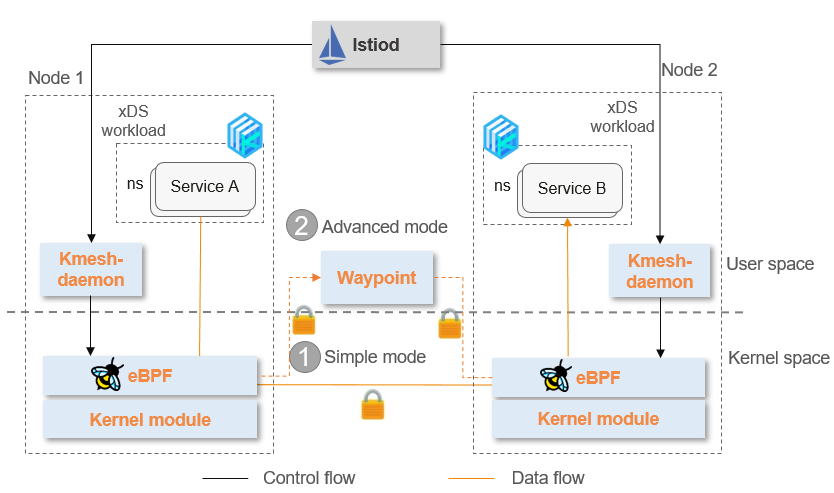

CNCF Landscape helps users understand specific software and product choices in each cloud-native practice phase. Kmesh joins CNCF Landscape and becomes a part of CNCF's best practice in building a cloud-native service mesh.

## Kmesh: Industry's First Kernel-Based Sidecarless Traffic Management Engine

### eBPF and Sidecarless Being the Future of Service Mesh

Service mesh has grown in popularity over recent years, but despite this, the sidecar pattern still faces challenges in resource overhead, upgrade and deployment, and latency. How to reduce the proxy overhead and build the sidecarless service mesh has become a longstanding problem in the industry.

At the beginning of project initiation, Kmesh innovatively proposed the industry's first kernel-based sidecarless traffic management engine to resolve this problem. The eBPF and programmable kernel technologies are used to sink L4–L7 traffic management into the OS. The traffic does not need to pass through a proxy and the service communication path in this case reduces from three hops to just one hop, eliminating the proxy overhead and implementing sidecarless service mesh.

### Advantages of Kmesh

- **High performance**
  Making use of kernel, it provides native support for L4–L7 traffic governance underneath, reducing the microservice forwarding latency by 60% and improving the microservice bootstrap performance by 40% compared with sidecar.
- **Low overhead**
  Workload has no sidecar injected, reducing the data plane overhead by 70%.
- **High availability**
  Kernel traffic management does not terminate connections, and Kmesh component upgrade and restart do not affect existing service connections.
- **Zero-trust network**
  Transparent zero-trust network can be achieved based on kernel mTLS.
- **Security isolation**
  eBPF-based VM security and cgroup-level governance isolation are supported.
- **Flexible management mode**
  In addition to the full-kernel management, Kmesh also supports slicing L4 and L7 management for isolation. The kernel eBPF program and waypoint component process L4 and L7 traffic respectively. It allows users to gradually migrate from layer 4 service management to layer 7 service management.
- **Seamless compatibility**
  It can seamlessly integrate with any control plane that supports xDS protocol in theory. Istio is the first one that Kmesh integrates with, and both Istio APIs and Gateway APIs are supported. Meanwhile, Kmesh can interop with sidecar, which allows migrating from sidecar to Kmesh seamlessly.

### Why Kmesh?

Kmesh is built with sidecarless network architecture, which is currently recognized by both the Istio community and the Cilium community. Sidecarless is also widely accepted by users. Compared with sidecar, sidecarless avoids extra resource overhead. It separates the application and proxy lifecycles, eliminating one-to-one binding and streamlining deployment and maintenance.

Kmesh leverages eBPF technology to perform traffic management in kernel mode, ensuring that traffic management operates seamlessly with traffic flows. By preventing service connections from being cut off, Kmesh reduces the number of connections along the traffic path and minimizes application access delays.

One significant drawback of user-mode traffic management is that proxy upgrades can result in service traffic loss. Kmesh addresses this issue by harnessing programmable kernel technology. In doing so, Kmesh gains a substantial industry advantage. The potential of eBPF technology is evident, and it is poised to drive further network innovations.

Kmesh also provides an advanced mode that enhances L7 traffic management by separating L4 and L7. This separation allows finer-grained physical isolation. Tenants, namespaces, or services can exclusively utilize L7 proxy waypoints. Waypoints can be dynamically scaled-in/scaled-out based on traffic load, which is more flexible and reliable. Unlike traditional centralized gateways, waypoints have no single point of failure.

**Therefore, we firmly believe that the optimal architecture of the sidecarless mode is combining eBPF technology with waypoint. This approach aims to reduce resource overhead and latency. Specifically, eBPF handles L4 routing and straightforward L7 traffic management on nodes, while more complex L7 protocols are routed to waypoint for comprehensive management.**

### Contributing to the Community

Kmesh, initiated by Huawei and incubated in the openEuler community, is currently hosted on GitHub as an independent project. It offers users traffic management technical solutions with exceptional performance.

Huawei, as the first vendor in China to engage in service mesh, has been contributing to the Istio community since 2018, making most contributions in Asia. Huawei also holds a seat in the Istio Steering Committee, which is responsible for governing Istio community.

Having accumulated extensive experience within the Istio community, we aspire to foster Kmesh's growth in an open and neutral manner. Our goal is to create an industry-leading sidecarless service mesh benchmark solution, catering to diverse industries, and fostering the healthy and organized evolution of service mesh technology. Kmesh is currently undergoing rapid development, and we warmly invite passionate individuals to join our efforts.

**Kmesh community:** [https://github.com/kmesh-net/kmesh](https://github.com/kmesh-net/kmesh)

### Reference

[1] CNCF Landscape: https://landscape.cncf.io/

[2] Introducing Ambient Mesh: https://istio.io/latest/blog/2022/introducing-ambient-mesh/

[3] Huawei Cloud ASM: https://support.huaweicloud.com/intl/en-us/asm/index.html

[4] Quick Start of Kmesh: https://kmesh.net/en/docs/setup/quickstart/
