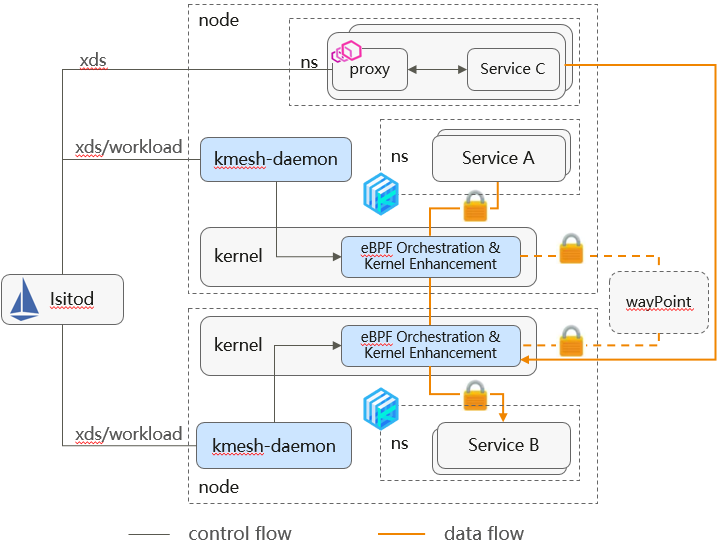

Kmesh is a brand new kernel-level traffic management engine, which helps users build high-performance communication infrastructure in cloud-native scenarios through basic software innovation. Users can deploy Kmesh[1] with one click using helm in a service mesh environment, seamlessly connecting to Istiod. By sinking the traffic management down to the OS, Kmesh achieves more than a 50% reduction in forwarding latency compared to the Istio Sidecar solution, providing applications with an ultimate forwarding performance experience.
## Introduction to Kmesh
Based on eBPF and programmable kernel technology, Kmesh sinks traffic management into the OS, eliminating the need for a proxy layer on the data path, and realizing a kernel-level sidecarless mesh data plane.

Key Capabilities of Kmesh:
- High Performance: Native support for L4~L7 traffic management functions in the kernel, enabling governance processes without passing through physical proxy components. This reduces the service communication path within the mesh from three hops under a proxy architecture to one hop, significantly improving the forwarding performance of the mesh data plane.
- Low Overhead: No need to deploy Sidecar alongside workload pods, greatly reducing the resource overhead of the mesh infrastructure.
- Safety Isolation: Runtime security based on eBPF, which supportcgroup-level governance isolation.
- Seamless Compatibility: Support integration with control planes of service meshes that support the XDS protocol, such as Istiod, and can also work collaboratively with existing Sidecar meshes.

The main components of Kmesh include:
- kmesh-controller: Responsible for bpf lifecycle management, xDS resources subscription, observability and other functions.
- kmesh-api: Adapter layer consisting of the orchestration API after xDS transformation, observability channels, etc.
- kmesh-runtime: Runtime implemented in the kernel to support L4~L7 traffic orchestration; the capability for Layer 7 orchestration runtime depends on enhancements to the kernel.
- kmesh-orchestration: Implements L4~L7 traffic orchestration based on eBPF, such as routing, canary releasing, load balancing, etc.
- kmesh-probe: Observability probe providing end-to-end observability capabilities.
## Performance Testing
We used fortio to test the performance of Istio (Envoy) and Istio(Kmesh) under the same traffic management scenarios, while also testing the latency of service communication based on kube-proxy(iptables) as a baseline reference.
Latency comparison at different numbers of connections:

Comparison of CPU overhead at the same QPS:

From the test results, we can see that:
- Kmesh's forwarding latency is almost close to the native Kubernetes forwarding latency, and it shows a significant improvement on latency compared with Istio sidecar mode.
- With the same QPS, Kmesh's CPU overhead is basically equivalent  to the native CPU overhead of Kubernetes, showing a significant reduction compared to Istio sidecar mode.
For detailed demo test details, you can watch our demonstration video:
https://youtu.be/Sk39kNJIKZE
## Key Technology Analysis of Kmesh
### Kernel-Level Traffic Orchestration Runtime
In microservice communication, connections are generally established before sending business messages. If you want to orchestrate business messages seamlessly, traffic interception is usually required. After orchestration is completed, the adjusted messages are then forwarded based on the interception. This is the current implementation of Proxy agents. Kmesh aims to complete governance work along with the flow and delays link establishment until the business message sending phase in order to achieve higher orchestration processing performance.
- Pseudo Connection Establishment
The pre_connect process loads the BPF prog. If the target address being accessed is within the scope of the XDS listener, it calls bpf_setsockopt to reload the tcp proto hook of the current socket to the kmesh_defer kernel module via TCP_ULP.
- Delayed Connection Establishment
The kmesh_defer kernel module rewrites the connect/send hooks (enhancements made on the native hooks):
  - When the service first reaches the connect hook, it sets the bpf_defer_connect flag and does not trigger the handshake process.
  - In the send hook, if the sock has the bpf_defer_connect flag set, it triggers the connect. At this point, it calls the BPF_SOCK_OPS_TCP_DEFER_CONNECT_CB through an extended BPF prog, completes traffic management, and then establishes a connection and sends messages based on the adjusted communication quintuple and messages.
The entire governance process is roughly as shown in the following diagram:

### XDS Rule Management
The xDS model is a hierarchical tree-like rule expression, and different version model definitions may be adjusted. Kmesh needs to convert the model information into eBPF map storage while maintaining the hierarchical relationships between model rules.
- Convert the xds model into eBPF map data

Specific Process:
1. Kmesh subscribes to Istiod's xds model and converts the pb model into a C data structure style based on protobuf-c.
2. For the top-level model (e.g., listener), Kmesh defines well-known map tables corresponding to it, and the data structure of the value reuses the C struct exported by protobuf-c.
3. Map updates start from the well-known map table of the top-level model. For pointer members in the records, the xds-adapter creates an inner-map table to store the actual data area pointed to by the pointer, adds the map fd of the inner-map to the map-in-map table, and finally uses its key (index) in the map-in-map table as the value for the pointer member. 
- map-in-map addresses the hierarchical nature of the xds model

For the value members of map records, if they are pointer variables (involving references to other data structures), the data area pointed to is stored through the inner-map:
  - If the value member is a basic data type (such as int), it is accessed directly.
  - If the value member is a pointer type, the value stored by the pointer is the index of the inner-map storing the actual data in the map-in-map table (Note: the index is written in coordination with updating the bpf map in the kmesh-daemon's xds-adapter module). When accessing, the map fd of the inner-map is first found based on the index, and then the actual data is retrieved from the inner-map table. For multi-level pointer members, this process is repeated until all pointer information is stripped away.
### Traffic Management Orchestration Implementation
The governance rules of xds are complex, involving hierarchical matching, which exceeds the complexity limit of a single eBPF program. Based on the eBPF Tail Calls feature, Kmesh divides the governance process into multiple independent eBPF progs, thus having good scalability.

## Key Features of Kmesh latest
- One-Click Deployment
The Kmesh community has released deployment images for Kmesh [2] and supports one-click deployment of Kmesh via helm [3].
- Namespace-based Enablement for Kmesh
Kmesh supports enabling traffic takeover scope based on namespace, such as: kubectl label namespace default label istio.io/dataplane-mode=Kmesh
- Seamless Integration with Istio Sidecar
For namespaces in the cluster that do not have Kmesh data plane enabled, if a sidecar proxy (such as Envoy) is used, Kmesh also supports interconnection. Additionally, sockmap can be used to accelerate traffic forwarding for the sidecar, resulting in a 10% to 15% performance improvement in forwarding without impacting the business process.
- Automated Integration with Service Mesh Control Plane
Kmesh supports automatic integration with Istiod, and in theory, any mesh control plane following the XDS protocol can integrate with Kmesh. This can be specified by modifying the MESH_CONTROLLER environment variable in the yaml.
- Support xds/workload
Kmesh supports the xDS model, enabling TCP traffic forwarding, HTTP/1.1 header matching, routing, and gray release. It also supports random and round-robin load balancing algorithms. Furthermore, it provides basic forwarding functionality based on the workload model.
## Looking Ahead
Kmesh is a high-performance traffic management engine based on eBPF and programmable kernel implementation. Compared to industry solutions, it offers higher forwarding performance and lower resource overhead. It can run in compatible mode on kernel versions without enhanced patches. For full governance capabilities of Kmesh, the current openEuler 23.03 version[4] already provides native support, while other operating systems require building based on enhanced patches[5].
Kmesh is gradually evolving into a more popular traffic management engine, and there is still a lot of work to be done. Currently, support for forwarding L7 traffic to waypoint and mTLS features has been planned. We welcome everyone to try Kmesh and stay connected with the Kmesh community[6]. Your participation is also highly anticipated.

## Meet Kmesh at KubeCon + CloudNativeCon Europe 2024
Kmesh will participate in several activities during KubeCon + CloudNativeCon Europe 2024, including:
### Kmesh Display: 
March 20-22 all day : Stop by Booth J1 at KubeCon to speak with an expert or see a demo!
### Kmesh OpenSpeech
Friday，Mar 22, 11:10-11:30 am CET 
Kernel-native Traffic Governance Framework Brings New Performance Experience

## Reference Links
[1] Kmesh releases: https://github.com/kmesh-net/kmesh/releases

[2] Deployment images for Kmesh: https://github.com/orgs/kmesh-net/packages

[3] One-click deployment of Kmesh: https://github.com/kmesh-net/kmesh?tab=readme-ov-file#quick-start

[4] openEuler 23.03 version: https://repo.openeuler.org/openEuler-23.03/

[5] Building based on enhanced patches: https://github.com/kmesh-net/kmesh/blob/main/docs/kmesh_kernel_compile.md

[6] Kmesh community address: https://github.com/kmesh-net/kmesh

