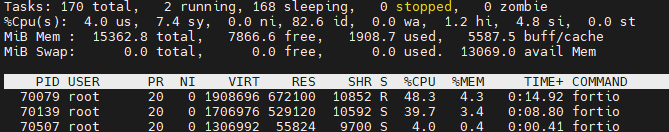
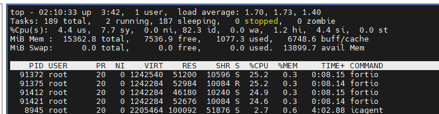
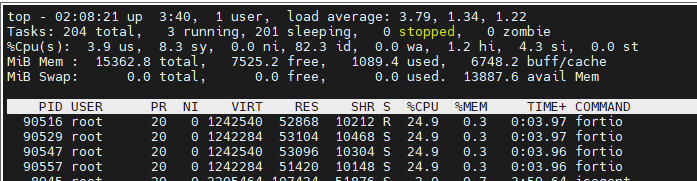

# 1. Environment setup


- K8S version: v1.27
- Kmesh version: 0.4
- Kernel version: 5.10
- Node flavor: 8U16G
- testing tool: fortio
- metric collecting tools: top, bpftop


# 2. Test case 1 - POD with CPU limit scenario，collect Kmesh eBPF CPU usage
## 2.1 Deploy 1 App A and set App A POD's CPU limit，then generage load and collect Kmesh eBPF CPU usage


Set the CPU limit for App A to 1 (1 CPU), and collect corresponding Kmesh eBPF CPU consumption.

**Note: With the system having 8 cores and a CPU limit of 1, it means the POD can consume up to 12.5% of the CPU.**

Testing result：


**Results and conclusions: When APP A uses up 1 CPU, the user space occupies 4%, the kernel space occupies 7.4%, totaling 11.4% of CPU consumption, which is less than the POD CPU limit of 12.5%. There are two possible reasons.**

- APP A and Kmesh eBPF share the POD CPU limit, with Kmesh eBPF CPU being restricted by the POD CPU limit.
- It is possible that due to the high performance of eBPF, APP A is not generating enough load to cause eBPF to exceed the CPU limit, further experiments in section 2.2 are needed.

## 2.2 Deploy multiple instances of App A, set a fixed CPU limit, generate load, and collect the corresponding Kmesh eBPF CPU consumption.


Start 4 instances of App A, with a CPU limit of 250m for each instance, totaling 1 CPU for all 4 instances.

Testing result：


When App A consumes 1 CPU, the user space occupies 4.4%, the kernel space occupies 7.7%, totaling 12.1% CPU usage. This is less than the POD CPU limit of 12.5%.

**Results and Conclusion: When App A consumes 1 CPU, the user space occupies 4.4%, the kernel space occupies 7.7%, totaling 12.1% CPU usage, which is less than the POD CPU limit of 12.5%. To further validate this conclusion, Experiment 2.3 will be conducted.**

## 2.3 Based on test 2.2, modify the eBPF code to decrease its performance, causing it to consume more CPU. Observe if it can exceed the POD CPU limit.

Add for loop in Kmesh eBPF code：
```c
for (i;0;i<10000;i++) {}
```

Testing result：


When APP A fully utilizes 1 CPU, the user space consumes 3.9% CPU, while the kernel space consumes 8.3%, totaling 12.2% CPU usage, which is still below the POD CPU limit (12.5%). Through multiple rounds of testing, the total CPU consumption of APP A and eBPF is always less than the POD CPU limit.


**Conclusion: Kmesh eBPF and APP share the POD CPU limit, with Kmesh eBPF CPU being limited by the POD CPU limit.**

# 3. Test case 2 - Scenario where POD CPU limit is not set, test the consumption of Kmesh eBPF CPU.
## 3.1 Scenario where the POD CPU limit is not set, test the Kmesh eBPF CPU limit.


Create 8 instances of APP A, set the CPU limit to unlimited. Gradually modify the number of processes generating load for APP A until the node's CPU usage reaches 100%, collect the CPU usage of Kmesh eBPF.

Test results (8-core CPU totaling 8000m):
|threads|APP A CPU Usage|eBPF CPU usage|
|--|--|--|
|100|12.3%|1%|
|500|35%|4.1%|
|1000|61.7%|8.8%|
|3000|67%|9.5%|

The total CPU of the system is 8 cores, which is equivalent to 8000m. When there are 3000 concurrent processes, the CPU of the node reaches 100% utilization. At this time, APP A consumes 67% of the CPU, and Kmesh eBPF consumes approximately 9.5%.

**Conclusion：**

- **APP A consumes much more CPU than eBPF, so it is not possible to overload eBPF. In a scenario tested with Fortio, Kmesh eBPF consumes a maximum of 9.5% CPU.**
- **Further testing is needed to determine the maximum CPU consumption limit for eBPF itself.**

## 3.2 eBPF CPU stress test, by adding infinite loops/large for loops in the eBPF code to boost CPU usage.
The [eBPF official documentation](https://ebpf-docs.dylanreimerink.nl/linux/concepts/verifier/) points out that eBPF programs have a robust security mechanism that automatically detects infinite loops and strictly limits the number of iterations in for loops. In the current Kernel version (v5.10), eBPF programs support a maximum of 65535 iterations in for loops.

Therefore, add 65535 for loops in the code and test it.
```c
int i;
for (i=0;i<65535;i++) {
    bpf_printk("increase cpu usage");
}
```

Testing result:


When the CPU of the node is running at 100%, Kmesh eBPF consumes approximately 99.3% of the CPU. This stress test lasted for 10 minutes, during which the kernel and services within the cluster continued to run stably.

**Conclusion: In the Kmesh eBPF component, when adding support for a maximum number of for loop scenarios, eBPF can consume all CPU resources. However, the kernel's security mechanisms ensure the stable operation of the system.**


# 4. Kmesh eBPF Memory limit test
The memory consumption of eBPF has an upper limit: as stated in the [official documentation](https://ebpf-docs.dylanreimerink.nl/linux/concepts/resource-limit/), this limit is set through the `memory.max` setting in cGroup configurations.

However, based on the current implementation of Kmesh, memory is allocated at the start of Kmesh, and does not increase during runtime. To verify the memory usage, the following test was conducted.

## 4.1 Create 1, 100, and 1000 services respectively in the cluster, and record the eBPF memory consumption.
Testing result:
|service number|eBPF Memory usage|
|--|--|
|1|23m|
|100|23m|
|1000|23m|

**Test results: The eBPF memory consumption of Kmesh is 23MB and remains constant, regardless of the number of services.**

## 4.2 Create a service APP A in the cluster, generate load, and observe eBPF memory consumption
**Test results: Kmesh eBPF memory consumption is 23MB and remains constant, regardless of the load**
