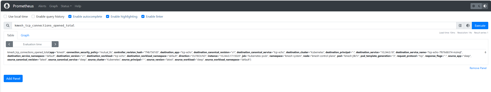

### Preparation

1. Install Kmesh:

Please refer [quickstart](https://kmesh.net/en/docs/setup/quickstart/)

Note that the following should be added to the Kmesh annotation:

```console
annotations:
    prometheus.io/path: "status/metric"
    prometheus.io/port: "15020"
    prometheus.io/scrape: "true"
```

2. Using Kmesh manage default namespace

```console
kubectl label namespace default istio.io/dataplane-mode=Kmesh

namespace/default labeled
```

3. Install the Prometheus Addon:

Istio provides a basic sample installation to quickly get Prometheus up and running:

```console
kubectl apply -f https://raw.githubusercontent.com/kmesh-net/kmesh/main/samples/addons/prometheus.yaml
```

4. Deploy the tcp-echo and sleep application

```console
kubectl apply -f https://raw.githubusercontent.com/kmesh-net/kmesh/main/samples/tcp-echo/tcp-echo.yaml 

kubectl apply -f https://raw.githubusercontent.com/kmesh-net/kmesh/main/samples/sleep/sleep.yaml

kubectl get po -A 
NAMESPACE            NAME                                          READY   STATUS    RESTARTS   AGE
default              sleep-bc9998558-pbfvk                         1/1     Running   0          7m
default              tcp-echo-7f676db574-mzmql                     1/1     Running   0          7m
```

Note: Confirm that sleep and tcp-echo are indeed [managed by kmesh](https://kmesh.net/en/docs/setup/quickstart/#deploy-the-sample-applications).

### Querying Metrics from Prometheus

Metrics monitored by Kmesh L4 at this stage:

|Name|Describe|
|---|---|
|kmesh_tcp_connections_opened_total|The total number of TCP connections opened|
|kmesh_tcp_connections_closed_total|The total number of TCP connections closed|
|kmesh_tcp_received_bytes_total|The size of total bytes received during request in case of a TCP connection|
|kmesh_tcp_sent_bytes_total|The size of total bytes sent during response in case of a TCP connection|

Here's how to view these metrics throught Prometheus:

**1. Verify that the prometheus service is running in your cluster.**

In Kubernetes environments, execute the following command:

```console
kubectl -n kmesh-system get svc prometheus

NAME         TYPE        CLUSTER-IP     EXTERNAL-IP   PORT(S)    AGE
prometheus   ClusterIP   10.96.18.252   <none>        9090/TCP   24h
```

**2. Send traffic to the mesh.**

Establish a TCP link between `sleep` and `tcp-echo` with the `nc` command:

```console
kubectl exec "$(kubectl get pod -l app=sleep -o jsonpath={.items..metadata.name})"  -c sleep -- sh -c 'echo "port 9000" | nc tcp-echo 9000' | grep "hello" && echo 'connection succeeded' || echo 'connection rejected'
hello port 9000
connection succeeded
```

**3. Open the Prometheus UI.**

Use the port-forward command to forward the traffic to Prometheus:9090.

```console
kubectl port-forward --address 0.0.0.0 svc/prometheus 9090:9090 -n kmesh-system
Forwarding from 0.0.0.0:9090 -> 9090
Handling connection for 9090
Handling connection for 9090
```

**4. Execute a Prometheus query.**

In the “Expression” input box at the top of the web page, enter the text:

```console
kmesh_tcp_connections_opened_total
```

The results will be similar to:

<div align="center">

</div>

You can also see the query results graphically by selecting the Graph tab underneath the Execute button.

<div align="center">

</div>

### Cleanup

Disable port-forward.

cleanup Prometheus:

```console
kubectl delete -f https://raw.githubusercontent.com/kmesh-net/kmesh/main/samples/addons/prometheus.yaml
```

If you are not planning to explore any follow-on tasks, refer to the [quickstart cleanup](https://kmesh.net/en/docs/setup/quickstart/#clean-up) instructions to shutdown the application.
