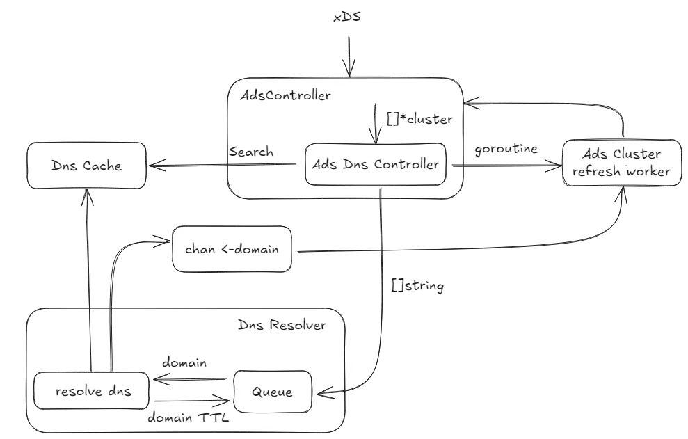

我们很高兴地宣布发布 Kmesh v1.2.0，延续了项目向生产就绪、内核原生服务网格的稳步演进。

在 v1.1 建立的坚实基础上，本次发布专注于加强可靠性、提高升级安全性以及通过 targeted 增强和改进加深与 Istio 生态系统的兼容性。在过去的发布周期中，社区紧密合作，识别现实世界的运营挑战，并通过有针对性的增强和改进来解决这些问题。

Kmesh v1.2.0 是开源社区持续合作的成果，汇聚了来自全球开发者和用户的宝贵贡献，包括 LXF 项目的持续支持。此版本并未引入破坏性更改，而是强调使现有功能更加健壮、可预测，并为长期运行的生产工作负载做好准备。

除了这些增强功能外，Kmesh 网站和文档也在不断发展，保持对新老用户的清晰度和可访问性。

## v1.2 核心增强功能

### DNS 与 dnsProxy

基于 v1.1 中引入的 DNS 重构，v1.2 添加了 dnsProxy 功能，允许 Kmesh 拦截托管服务的 DNS 解析请求。

专用的域名到 IP 映射表提高了主机名解析的可靠性，并简化了与非 Kubernetes 原生服务的集成。这些增强功能确保了所有操作模式下服务发现的一致性，并在复杂的部署场景中提高了整体 DNS 性能。

### IPsec 增强

Kmesh v1.2 通过增强的 IPsec 支持加强了安全性和运行稳定性。通过重新设计的 eBPF 解密逻辑和优化的 xfrm 状态及策略配置，解决了 Kmesh 管理节点与未管理节点之间的关键互操作性问题。

此外，kmeshctl 工具现在提供加密密钥的秘钥管理，简化了安全通信的秘钥创建和生命周期管理。

### ServiceEntry 改进

v1.2 中全面扩展了 ServiceEntry 支持。用户现在可以利用 dnsProxy 无缝集成各种外部服务，包括非 Kubernetes 原生工作负载。这一改进拓宽了服务网格集成的范围，并简化了混合环境中的连接。

### 零停机升级

基于 v0.5.0 的成就，v1.2 引入了在 BPF 映射结构保持不变的情况下升级 Kmesh 守护进程而不中断已建立连接的能力。目前处于 alpha 阶段，此功能显着减少了维护操作期间的服务停机时间，并增强了生产部署的整体可靠性。

### 双引擎模式增强

双引擎模式现在支持熔断和本地限流，从而提供对服务间通信的更精细控制。这些功能提高了弹性，防止服务故障和流量激增，并增强了不同负载条件下的系统稳定性。

### Istio 兼容性更新

Kmesh v1.2 确保与 Istio 1.26 的完全兼容性，允许用户利用最新的功能和安全改进。CI 测试中已弃用对 Istio 1.23 的支持，鼓励升级到较新版本以获得更好的性能和功能可用性。

## 关键错误修复与稳定性改进

Kmesh v1.2 包含大量修复和改进，增强了稳定性、可靠性和操作安全性。我们的团队和贡献者致力于解决关键问题，提高安全性，并确保服务网格各层的生产就绪性。

### IPsec 与安全增强

解决了启用 IPsec 的 Pod 之间的通信问题，kmeshctl 现在支持自动生成秘钥，简化了安全通信设置。添加了额外的 E2E 测试以验证正确性并防止回退。这些更改提高了可用性和集群安全性。
参见 GitHub PRs #1496, #1487

### Kmeshctl 与工作流修复

对 kmeshctl 和开发工作流进行了多项增强，包括新命令、准备脚本 (prepare-dev) 和文档同步工作流。修正了轻微的可用性问题，简化了开发人员与 CLI 的交互，并减少了设置和维护期间的摩擦。
参见 PRs #1426, #1498

### eBPF 与内核原生修复

修复了与跨命名空间通信和连接指标相关的不稳定测试用例，并添加了 cgroup_skb eBPF 程序以改善网络数据包处理。这些修复增强了内核原生模式的可靠性，并减少了生产环境中的错误。
参见 PRs #1452, #1474

### CI、依赖项与文档更新

升级依赖项以解决漏洞，优化 CI 工作流，并应用了包括 markdown linting 和中文语法检查在内的文档改进。这些更改确保了安全、可靠的构建，并提高了贡献者的可用性。
参见 PRs #1434, #1484

### Istio 适配与升级安全

Kmesh v1.2 完全适配 Istio 1.26，在 CI 测试中弃用了旧版本。启用零停机升级的提案和功能确保 Kmesh 可以在不中断现有连接的情况下进行更新，从而增强生产就绪性。
参见 PRs #1513, #1503, #1441

总之，这些修复和增强使 Kmesh v1.2 更加健壮、稳定和安全，为生产部署提供了信心，并为未来的功能开发奠定了坚实的基础。

## 致谢

Kmesh v1.2.0 建立在 v1.1 的坚实基础之上，反映了快速增长的社区的贡献。我们非常高兴地欢迎以下在此版本中首次做出贡献的新贡献者：

- @Flying-Tom
- @zrggw
- @yashisrani
- @AkarshSahlot
- @mdimado
- @Vinnu124
- @wxnzb
- @072020127
- @xiaojiangao123
- @Copilot

此外，Kmesh v1.2.0 包含了我们整个贡献者社区的贡献，包括：

- @YaoZengzeng @hzxuzhonghu @dependabot
- @Flying-Tom @zrggw @sancppp
- @Kuromesi @072020127 @yashisrani
- @yp969803 @AkarshSahlot @mdimado
- @xiaojiangao123 @lec-bit @Vinnu124
- @LiZhenCheng9527 @wxnzb 以及其他许多人。

## 参考链接

- [Kmesh Release v1.1.0](https://github.com/kmesh-net/kmesh/releases/tag/v1.1.0)
- [Kmesh GitHub](https://github.com/kmesh-net/kmesh)
- [Kmesh Website](https://kmesh.net/)
