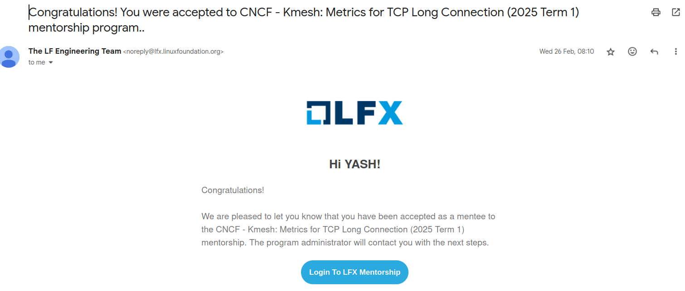
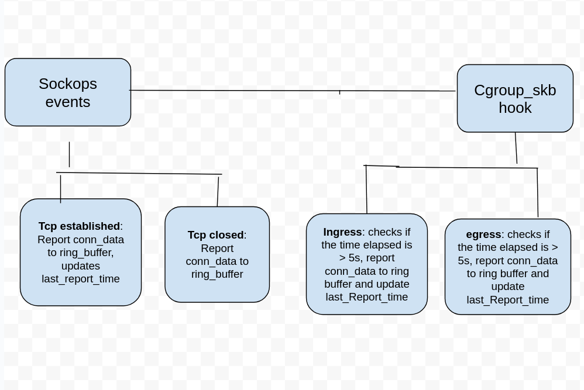

## 介绍

读者好，我是 Yash，来自印度的一名应届毕业生。我喜欢构建很酷的东西并解决现实世界的问题。过去三年我一直在云原生领域工作，探索 Kubernetes、Cilium、Istio 等技术。

我有幸完成了 LFX 2025 第一期 Kmesh 的指导计划，这是一次丰富且宝贵的经历。在过去的三个月里，我在为项目做贡献的同时，获得了大量的知识和实践经验。在这篇博客中，我记录了我的指导旅程以及我作为学员所完成的工作。

## LFX 导师计划 – 概述

由 Linux 基金会运营的 LFX 导师计划旨在帮助学生和早期职业专业人士通过在经验丰富的导师指导下参与实际项目，获得开源开发的实践经验。

参与者为 CNCF、LF AI、LF Edge 等基金会托管的高影响力项目做出贡献。该计划通常全年分 3 期通过，每期持续约三个月。

[更多信息](https://mentorship.lfx.linuxfoundation.org/#projects_all)

## 我的录取

我是一名活跃的开源贡献者，热爱为开源做贡献。我的兴趣与云原生技术高度一致。我熟悉 LFX 和 GSoC 等流行的指导计划，这些计划旨在帮助学生开启开源世界的大门。
基于我的工作，Kmesh 社区也提拔我成为 Kmesh 的成员。
我下定决心申请 LFX 2025 第一期，并于 2 月初开始探索项目。LFX 下 CNCF 的项目列在 [cncf/mentoring](https://github.com/cncf/mentoring) GitHub 仓库中。我遇到了 [Kmesh](https://github.com/kmesh-net/kmesh) 项目，这是一个新加入 CNCF 沙箱并在 LFX 首次参与的项目。
我发现 Kmesh 项目特别令人兴奋，因为它解决的问题是提供无 Sidecar 的服务网格数据平面。这种方法可以通过提高性能和减少开销极大地造福社区。

Kmesh 在第一期提出了 4 个项目，我选择了 [long-connection-metrics](https://github.com/kmesh-net/kmesh/issues/1211) 项目，因为它允许我使用 eBPF，而我已经有了使用 eBPF 的相关经验。

我通过阅读文档和为 Good First Issues 做贡献开始了 Kmesh 项目的探索。随着我参与度的加深，导师们开始注意到我。我还为长连接指标项目提交了一份 [提案](https://github.com/kmesh-net/kmesh/blob/main/docs/proposal/tcp_long_connection_metrics.md)。

2 月下旬，我收到了 LFX 的邮件，通知我也被选中了。

## 项目演练

`tcp long connection metrics` 项目旨在实现 TCP 长连接的访问日志和指标，开发一种持续监控和报告机制，以便在长生存期 TCP 连接的整个生命周期内捕获详细的实时数据。

使用 Ebpf 钩子收集连接统计信息，如发送/接收字节数、丢包数、重传数等。

[更多信息](https://kmesh.net/docs/transpot-layer/l4-metrics)

## 导师体验

Kmesh 维护者总是随时准备帮助我解决任何疑问，无论是在 Slack 还是 GitHub 上。此外，每周四定期举行社区会议，我可以在会上提问并讨论各种话题。在过去的三个月里，我从他们身上学到了很多，包括如何有效地解决问题以及在开发过程中考虑边缘情况。

基于我的贡献和积极参与，Kmesh 社区认可了我的努力，并提拔我为组织成员。这种认可确实令人鼓舞，并激励我继续为 Kmesh 做贡献并帮助项目成长。
