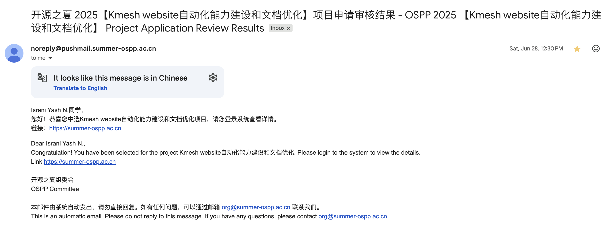
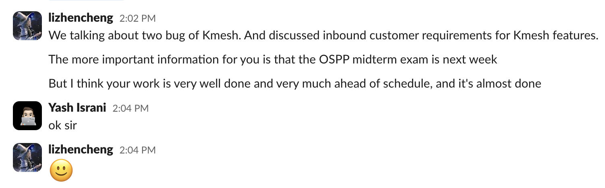

# OSPP 2025 | 为 Kmesh 自动化文档和发布工作流

## 介绍

大家好！我是 **Yash Israni**，一名开源爱好者，热衷于自动化、DevOps 实践以及构建消除重复性手动工作的工具。

今年夏天，我有幸参加了 **2025 开源促进计划 (OSPP)**，在那里我与 [Kmesh](https://github.com/kmesh-net/kmesh) 社区合作，自动化文档和发布工作流。在三个月的时间里，我设计并实施了 GitHub Actions 流水线，使 Kmesh 网站始终保持最新、正确版本化并进行语言质量审查。

在这篇博客中，我将分享我的旅程——从最初被录取到项目执行，我所做的技术决策以及在此过程中学到的经验教训。

<!-- truncate -->

## OSPP 计划 – 概述

由中国科学院软件研究所 (ISCAS) 组织的 **开源促进计划 (OSPP)** 为学生和早期职业贡献者提供了机会，通过在导师指导下参与有影响力的开源项目来获得实践经验。

每期持续约 **三个月**（就我而言是 7 月 1 日至 9 月 30 日）。贡献者不仅交付现实世界的功能，而且还学习大型开源社区的运作方式。

---

## 我的录取

我一直喜欢为开源做出贡献，我的兴趣自然与自动化和云原生工具相一致。当我看到 **Kmesh** 在 OSPP 2025 下提供项目时，我立即被他们关于自动化文档工作流的提议所吸引。

该项目解决了一个明显的痛点：文档更新和版本控制以前是手动完成的，通常滞后于发布。用可靠的自动化取代重复性任务的机会既有影响力又充满挑战。

我在 **2025 年 6 月 28 日收到了录取通知书**，该计划正式从 **7 月 1 日运行到 9 月 30 日**。

有趣的是，我能够在 **中期评估之前** 完成大部分项目工作，因此跳过了该检查点，给了我额外的时间来完善工作流并编写正确的使用指南。

---

## 项目演练

### 1. 文档同步工作流

- **触发器：** 每次推送到主分支时
- **动作：** 在网站仓库中打开一个包含最新文档更新的拉取请求
- **增强功能：** 自动标记 PR 以便分类，并运行网站的 CI 流水线以验证更改

### 2. 发布版本控制工作流

- **触发器：** 当推送新的 Git 标签（发布事件）时
- **动作：** 在网站仓库中生成文档的带版本快照
- **增强功能：** 自动为任何与版本控制相关的更改打开 PR

### 3. 中文语法检查器工作流

- **触发器：** 在修改中文文档的拉取请求上
- **动作：** 使用 **LanguageTool API** 检测语法和样式问题
- **增强功能：** 发布行级审查评论作为 **警告（非阻塞）**，以便贡献者在不被阻止合并的情况下收到建议

---

## 结果

| 指标             | 以前 (手动)      | 以后 (自动化)    | 改进                 |
| ---------------- | ---------------- | ---------------- | -------------------- |
| 发布后更新文档   | 3–5 天           | < 1 分钟         | **>99% 更快** 🚀     |
| 网站版本控制更新 | 延迟 / 不一致    | 每次发布即时更新 | **100% 可靠** ✅     |
| 中文文档审查时间 | 每次 PR ~20 分钟 | 每次 PR ~1 分钟  | **节省 95% 时间** ⏱️ |

这些工作流有效地 **消除了延误和手动错误**，确保 Kmesh 文档保持准确和最新。

所有三个工作流现在都在 Kmesh 主仓库和网站仓库的 `.github/workflows` 下上线。

---

## 关键技术决策

- 采用 **repository dispatch** 进行安全的跨仓库通信，消除了对长期存在的个人令牌的需求
- 仅在必要时授予 GitHub Actions 令牌 **读写权限**，同时将其他操作委托给范围受限的机器人账户以提高安全性
- 通过动态生成 `versions.json` 实现了 **Docusaurus 兼容的版本控制**，使导航与发布保持同步
- 在文档同步工作流中添加了 **强大的错误处理**，以优雅地管理丢失的文件夹或文件，防止工作流崩溃

---

## 导师体验

我的导师 **Li Zhencheng** 和 **Zhonghu Xu**，以及 Kmesh 维护者，一直给予我支持——无论是通过 GitHub 审查还是 Slack 上的快速澄清。尽管我提前交付了主要工作流，但他们的反馈帮助我完善了边缘情况并提高了整体可靠性。

为了表彰我的贡献和积极参与，Kmesh 社区欢迎我成为 **组织成员**。这种认可既令人谦卑又充满动力，它加强了我继续为 Kmesh 做贡献并支持其成长的承诺。

---

## 经验教训

1. **自动化赋能于人** – 目标不是取代贡献者，而是将他们从重复性任务中解放出来，以便他们能够专注于有意义的审查和设计。
2. **小步快跑，持续迭代** – 以增量、可测试的步骤构建工作流，使得调试和维护比一次性部署所有内容要容易得多。
3. **安全性至关重要** – 对令牌和权限应用最小特权原则，在保持自动化安全的同时降低了风险。
4. **预见边缘情况** – 工作流在不同环境中的行为不同；在分叉和多个平台上进行测试可防止生产中的意外。
5. **文档是代码的一部分** – 编写清晰的工作流描述和 PR 评论可确保维护者信任并理解自动化正在做什么。

---

## 致谢

我要衷心感谢我的导师 **Li Zhencheng** 和 **Zhonghu Xu** 的指导、快速审查和鼓励。同时也感谢 **OSPP 计划工作人员** 确保整个学期的顺利运行。

---

## 链接

- [项目问题与拉取请求](https://github.com/kmesh-net/kmesh/issues/1412)
- [OSPP 网站](https://summer-ospp.ac.cn)
- [Yash Israni's github](https://github.com/yashisrani)

---
