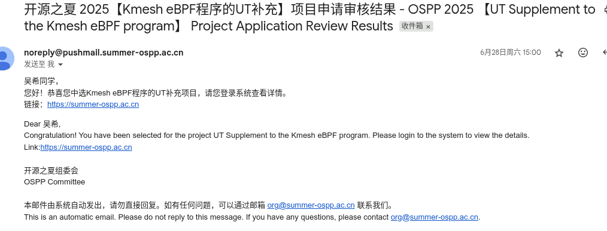
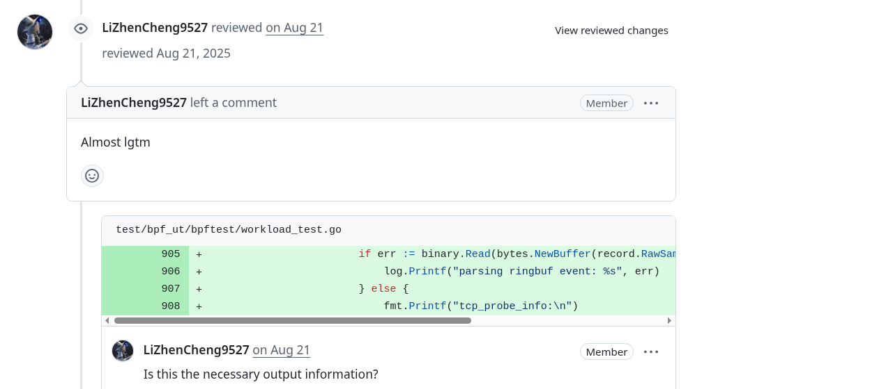
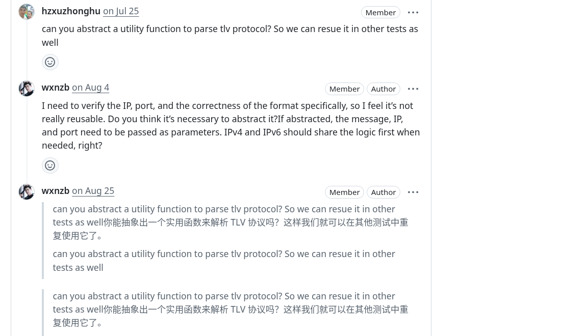
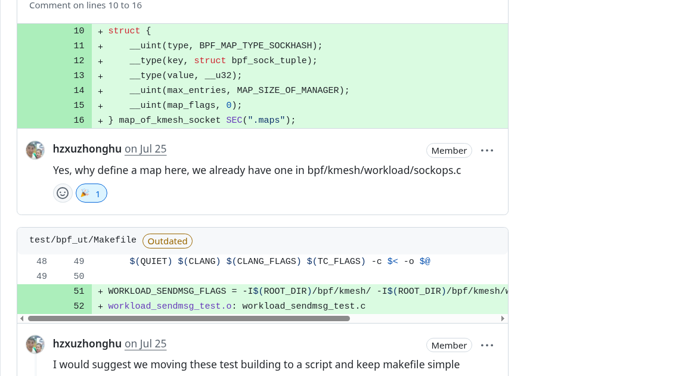
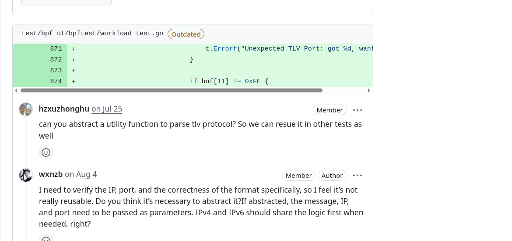

# OSPP 2025 | 为 Kmesh 完成 eBPF 单元测试

## 介绍

大家好！我是 **Wu Xi**，一名对内核网络、eBPF 和测试工程有浓厚兴趣的开源爱好者。

今年夏天，我有幸参加了 **2025 开源促进计划 (OSPP)** 并与 [Kmesh](https://github.com/kmesh-net/kmesh) 社区合作，专注于 eBPF 程序 UT 增强。在三个月的时间里，我主要完成了 Kmesh eBPF 程序的单元测试工作。我为 sendMsg 和 cgroup 程序编写并成功运行了 UT 测试代码，并在此基础上补充了测试文档。现在，Kmesh 社区开发者无需依赖实际内核挂载和流量模拟即可验证 eBPF 程序逻辑，显着提高了开发效率。
在这篇博客中，我将分享我的完整经历——从录取到项目执行、技术选择以及沿途学到的经验教训。

<!-- truncate -->

## OSPP 项目概述

**开源促进计划 (OSPP)** 由 **中国科学院软件研究所 (ISCAS)** 组织，为学生和早期职业开发者提供了在经验丰富的导师指导下合作开展实际开源项目的机会。

每期持续约 **三个月**（我的项目周期是 7 月 1 日至 9 月 30 日）。参与者不仅交付功能特性，而且还能亲身体验大型开源社区的运作方式。

---

## 我的录取经历

我一直喜欢参与开源，而且我的兴趣点恰好集中在网络内核及云原生工具上。当我在 OSPP 2025 看到 **Kmesh** 提供的“eBPF”和“单元测试”相关课题时，我立刻被吸引了。

这个项目要解决的痛点非常清晰：长期以来 eBPF 程序的验证依赖黑盒测试，不仅效率低，而且覆盖率依赖测试人员的经验。引入单元测试框架并补充关键用例，能在不需要实际内核挂载的情况下完成功能验证，这既有价值也充满挑战。

我在 **2025 年 6 月 28 日** 收到了中选邮件，项目正式周期从 **7 月 1 日到 9 月 30 日**。

有趣的是，我在 **中期考核前** 就完成了项目的主要工作，因此跳过了这个阶段。这给了我更多时间去打磨工作流和编写使用文档。

---

## 项目工作内容

### 1. eBPF 单元测试框架构建

- **核心技术：** 基于 #define mock 宏替换的 eBPF 内核函数模拟
- **测试覆盖：** 覆盖 sendmsg TLV 编码、cgroup sock 连接管理、cgroup skb 流量处理
- **创新点：** 通过条件编译 #ifdef KMESH_UNIT_TEST 将测试基础设施嵌入生产代码

### 2. sendmsg TLV 编码验证

- **测试目标：** 验证 waypoint 场景下 TLV 元数据编码的正确性
- **测试数据：** IPv4 (8.8.8.8:53) 和 IPv6 (fc00:dead:beef:1234::abcd:53) 模拟数据
- **验证机制：** 实时解析 TLV 报文格式，校验 type、length、IP 及端口的完整性

### 3. cgroup 生命周期管理测试

- **Hook 覆盖：** cgroup/connect4, cgroup/connect6, cgroup/sendmsg4, cgroup/recvmsg4
- **测试场景：** kmesh 管理进程注册/注销、后端无 waypoint 连接、尾调用机制
- **验证方式：** 通过 km_manage map 状态变化验证 netns cookie 管理的正确性

---

## 项目成果

| 指标                 | 以前 (手动)                | 以后 (自动化)        | 改进                 |
| -------------------- | -------------------------- | -------------------- | -------------------- |
| TLV 编码验证耗时     | 30-60 分钟/场景            | < 5 秒/场景          | **>99% 更快** 🚀     |
| cgroup hook 回归测试 | 半天手动部署验证           | 自动化并行执行       | **节省 95% 时间** ⏱️ |
| 测试环境依赖         | 需要完整的 Kubernetes 集群 | 纯 eBPF 程序单元测试 | **零依赖** 🎯        |

这些测试框架有效地 **消除了 eBPF 程序测试的盲区**，保障了 Kmesh 数据平面的稳定性和正确性。

目前，测试框架已集成到 CI/CD 流水线中，通过 make run 命令即可执行完整的 eBPF 单元测试套件，覆盖了 workload、XDP、sockops、sendmsg、cgroup_skb、cgroup_sock 等核心组件。

---

## 关键技术决策

- 使用 **define mock** 进行函数置换，通过 #define bpf_sk_storage_get mock_bpf_sk_storage_get 等宏定义在编译时替换 eBPF 内核函数，实现单元测试的依赖隔离
- 采用 **条件编译** 测试基础设施，通过 #ifdef KMESH_UNIT_TEST 宏将测试专用的 map 定义和数据结构嵌入生产代码，确保测试代码与生产代码的一致性
- 使用 **Go + eBPF** 混合测试框架，结合 C 语言 eBPF 程序编译与 Go 语言测试执行，通过 go test -v ./... 实现自动化测试工作流

---

## 导师指导体验

我的导师 **Li Zhencheng** 和 **Xu Zhonghu**，以及其他 Kmesh 维护者，在整个 UT 测试框架开发过程中给予了极大的支持。

他们不仅在 GitHub review 中耐心地指出测试设计的改进点，还在 Slack 上迅速解答了我关于 bpf helper mock 和 map 验证的疑问。

虽然我较早完成了 `sendMsg` 和 `cgroup` 程序的核心 UT，但导师的反馈让我注意到更多边界情况 (edge cases)，并推动我进一步完善了测试覆盖率和文档。

最后，Kmesh 社区邀请我成为 **组织成员 (Organization Member)** 以表彰我的贡献和积极参与。这不仅让我感到受宠若惊，更加定了我继续参与并支持 Kmesh 发展的决心。

---

## 经验教训

1. **单元测试是提升开发效率的工具** — 它不代替黑盒测试，而是补充和解放开发者，让他们能更快地专注功能实现和优化。
2. **从小处着手，逐步迭代** — 先补充核心 eBPF 程序（如 sendMsg, cgroup_skb）的 UT，再逐渐扩展到更多场景，这比一次性覆盖所有逻辑更稳健。
3. **预见边界情况** — eBPF 程序在不同内核版本或环境下的行为可能不同；提前在 UT 中模拟各种输入和异常，有助于避免生产环境的意外。
4. **交流能加速学习进度** — 每次提交 PR，导师们都会在评论中给出更好的解法或疑问，这让我在短时间内学到了很多。
5. **直面困难是进步的不二法门** — 在学习自己感兴趣但接触不深的领域时，受挫在所难免。哪怕就在这种时候也别放弃，相信自己并坚持尝试，终能找到问题的解法。

---

## 致谢

我要衷心感谢我的导师 **Li Zhencheng** 和 **Xu Zhonghu** 在全过程中的指导。在每次社区例会中，他们都会积极解决我当下的问题并了解我的进度。每当我提交 PR，他们都会在评论中分享见解，让我的思路变得更清晰，也提升了我的解题能力。我也要感谢 **OSPP 组委会** 为我们提供了一个顺利运行的环境。这次开源参与对我来说是一次非凡的经历，我将继续致力于开源并热爱开源！

---

## 相关链接

- [项目 Issue 与 Pull Request](https://github.com/kmesh-net/kmesh/issues/1411)
- [OSPP 官网](https://summer-ospp.ac.cn)
- [Wu Xi's GitHub](https://github.com/wxnzb)
